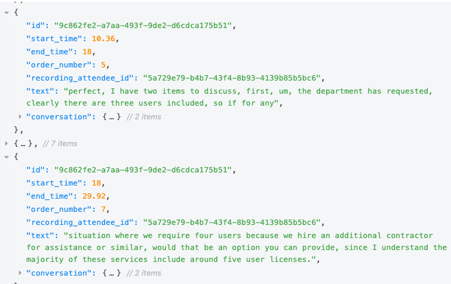
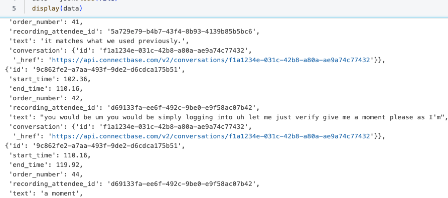
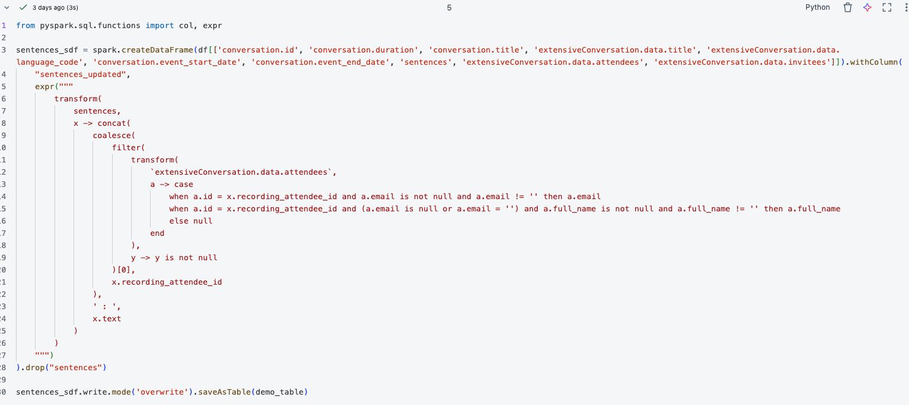
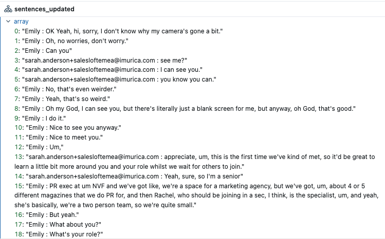

### Sales Coaching on Databricks: LLM-based Call Center Analytics (YouTube Talk Script)

This talk walks through a practical, end‑to‑end workflow to coach sales representatives using call transcripts on Databricks. It is grounded in the code and screenshots in this repository and references official docs for each Databricks capability used.

---

## 1) Problem and Outcomes

- **Use case**: Coach sales reps by analyzing call transcripts to extract highlights, assessments, and metrics.
- **Interim artifacts we produce**:
  - **Per‑participant assessments** (skills, strengths, recommendations, performance score, etc.) via `ai_query`.
  - **Vectorized representations** for semantic search and retrieval.
  - **RAG chatbot** that answers questions grounded in participant analyses.
- **Databricks capabilities highlighted**: Unity Catalog tables and Volumes, AI Functions (`ai_query`), Vector Search Index, Model Serving (Foundation Model APIs), MLflow logging/registry, RAG with `databricks‑langchain`, and Agents for deployment.

---

## 2) Visual Narrative (screenshots in repo)

Use these in the talk to visually anchor each step:

- Raw to structured and cleaned data:
  - `screenshots/0001_raw_conversation.png`
  - `screenshots/0002_raw_conversation_parsed.png`
  - `screenshots/0003_data_cleansing.png`
  - `screenshots/0004_generate_transcription.png`

- AI‑assisted participant assessments:
  - `screenshots/0005_ai_query_generate_participant_assessment.png`
  - `screenshots/0006_ai_query_assessment_result_one_participant.png`
  - `screenshots/0007_ai_query_assessment_all_participants.png`
  - `screenshots/0008_segregate_each_participant.png`

- Vector search and RAG:
  - `screenshots/0009_TextToVector.png`
  - `screenshots/0010_VectorSearchIndexResult.png`
  - `screenshots/0011_RAG_response.png`
  - `screenshots/0012_RAG_response.png`
  - `screenshots/0013_RAG_references.png`

Embed examples in slides:

```markdown




```

---

## 3) Step‑by‑Step Architecture

### 3.1 Initialize workspace paths and targets

Key workspace parameters are defined for Unity Catalog catalog/schema, volumes, and Vector Search naming.

```python
# From 000_initialize.py
catalog_name = 'users'
schema_name = 'brijendra_raghuwanshi'
source_location = f'/Volumes/{catalog_name}/{schema_name}/conversation_demo_data'

VECTOR_SEARCH_ENDPOINT_NAME = "dbdemos_vs_endpoint"
source_table_for_embedding = "each_participant_summary"
embedded_table_fullname = f"{catalog_name}.{schema_name}.each_conversation_participant_summary_embedded"
vs_index_fullname = f"{catalog_name}.{schema_name}.each_conversation_participant_summary_vsi"
volume_folder = f'/Volumes/{catalog_name}/{schema_name}/conversation_summmary_checkpoint'
```

Docs: `Unity Catalog` tables/volumes and governance — see `https://docs.databricks.com/en/data-governance/unity-catalog/index.html`.

### 3.2 Build per‑participant assessments with AI Functions (`ai_query`)

- The pipeline reads JSON transcripts, labels each sentence with a participant identifier (or name/email when available), saves a staging table, and then uses `ai_query` to generate structured assessments.
- We enforce a strict JSON schema in `ai_query` and instruct the model to mask sensitive info.

```sql
-- From 001_get_data.py (%sql cell)
create or replace table users.brijendra_raghuwanshi.conversation_participant_summary as
with participant_summary as (
  SELECT 
    `conversation.id` as conversation_id,
    `conversation.title` as title,
    `conversation.event_start_date` as event_start_date,
    `conversation.event_end_date` as event_end_date,
    ai_query(
      'databricks-claude-3-7-sonnet',
      "Analyze this sales call transcript and extract individual participant details...\n" ||
      ' - TRANSCRIPT: ' || to_json(`sentences_updated`),
      responseFormat => '{
        "type": "json_schema",
        "json_schema": {
          "name": "participant_analysis",
          "schema": {
            "type": "object",
            "properties": {
              "participants": {"type": "array", "items": {"type": "object", ... }}
            },
            "required": ["participants"],
            "additionalProperties": false
          },
          "strict": true
        }
      }'
    ) AS participant_analysis
  FROM users.brijendra_raghuwanshi.conversation_demo
)
select conversation_id, title, event_start_date, event_end_date,
       from_json(participant_analysis, 'STRUCT<participants: ARRAY<STRUCT<...>>>>') as participant_analysis
from participant_summary;
```

Why this matters:
- `ai_query` lets you call a foundation model from SQL, optionally validating the response to a JSON Schema. See `https://docs.databricks.com/en/sql/language-manual/functions/ai_query.html`.
- The prompt explicitly requests masked PII (fake names/companies), aligning with governance requirements.

Then we explode to one row per participant:

```sql
-- From 001_get_data.py (%sql cell)
create or replace table users.brijendra_raghuwanshi.each_participant_summary as
select 
  conversation_id, title, event_start_date, event_end_date,
  participant.name as name,
  participant
from users.brijendra_raghuwanshi.conversation_participant_summary
lateral view explode(participant_analysis.participants) as participant;
```

Docs: Databricks AI Functions overview — `https://docs.databricks.com/en/large-language-models/ai-functions.html`.

### 3.3 Create embeddings and a Vector Search Index

Two supported patterns in this repo:

1) **Pre‑compute custom embeddings and index the embedded Delta table**:

```python
# From 002_create_vector_search_index.py (selected)
from mlflow.deployments import get_deploy_client
from databricks.vector_search.client import VectorSearchClient
from pyspark.sql.functions import to_json, col, pandas_udf

deploy_client = get_deploy_client("databricks")

@pandas_udf("array<float>")
def get_embedding(contents: pd.Series) -> pd.Series:
    deploy_client = mlflow.deployments.get_deploy_client("databricks")
    def get_embeddings(batch):
        response = deploy_client.predict(endpoint="databricks-gte-large-en", inputs={"input": batch})
        return [e['embedding'] for e in response.data]
    ...

spark.sql(f"""
  CREATE TABLE IF NOT EXISTS {embedded_table_fullname} (
    id BIGINT GENERATED BY DEFAULT AS IDENTITY,
    conversation_id STRING,
    content STRING,
    name STRING,
    embedding ARRAY <FLOAT>
  ) TBLPROPERTIES (delta.enableChangeDataFeed = true)
""")

(spark.readStream.table(f'{catalog_name}.{schema_name}.{source_table_for_embedding}')
      .withColumn('content', to_json(col('participant')))
      .withColumn("embedding", get_embedding("content"))
      .selectExpr('conversation_id', 'content', 'name', 'embedding')
  .writeStream
    .trigger(availableNow=True)
    .option("mergeSchema", "true")
    .option("checkpointLocation", f'dbfs:{volume_folder}/checkpoints/pdf_chunk')
    .table(f'{embedded_table_fullname}').awaitTermination())

vsc = VectorSearchClient()
vsc.create_delta_sync_index(
  endpoint_name=VECTOR_SEARCH_ENDPOINT_NAME,
  index_name=vs_index_fullname,
  source_table_name=embedded_table_fullname,
  pipeline_type="TRIGGERED",
  primary_key="id",
  embedding_dimension=1024,
  embedding_vector_column="embedding"
)
```

2) **Let Vector Search compute embeddings from a text column** (Delta Sync Index):

```python
# From z_002_create_vector_search_index.py (selected)
from databricks.vector_search.client import VectorSearchClient
vsc = VectorSearchClient()

vsc.create_endpoint(name=VECTOR_SEARCH_ENDPOINT_NAME, endpoint_type="STANDARD")

vsc.create_delta_sync_index(
  endpoint_name=VECTOR_SEARCH_ENDPOINT_NAME,
  index_name=vs_index_fullname,
  source_table_name=f"{catalog_name}.{schema_name}.conversation_participant_summary",
  pipeline_type="TRIGGERED",
  primary_key="conversation_id",
  embedding_source_column='participant_analysis',
  embedding_model_endpoint_name='databricks-gte-large-en'
)
```

Query the index (hybrid search supports query text + vector):

```python
# From 002_create_vector_search_index.py (selected)
question = "Give me the how many meetings were conducted by Emma"
response = deploy_client.predict(endpoint="databricks-gte-large-en", inputs={"input": [question]})
embeddings = [e['embedding'] for e in response.data]

results = vsc.get_index(VECTOR_SEARCH_ENDPOINT_NAME, vs_index_fullname).similarity_search(
  query_vector=embeddings[0],
  query_text=question,
  columns=["conversation_id", "content", "name"],
  num_results=10,
  query_type='hybrid'
)
```

Docs:
- Vector Search overview and Python SDK — `https://docs.databricks.com/en/generative-ai/vector-search/index.html`
- Create Delta Sync Index — `https://docs.databricks.com/en/generative-ai/vector-search/create-index.html`
- Foundation Model APIs (e.g., `databricks-gte-large-en`) — `https://docs.databricks.com/en/generative-ai/foundation-models/index.html`

### 3.4 Retrieval‑Augmented Generation (RAG) with `databricks‑langchain` and MLflow

We configure a RAG chain that uses Databricks Vector Search as a retriever and a Databricks‑served chat model for generation.

Config file (checked into repo):

```yaml
# From rag_chain_config.yaml (selected)
databricks_resources:
  llm_endpoint_name: databricks-claude-3-7-sonnet
  vector_search_endpoint_name: dbdemos_vs_endpoint
retriever_config:
  embedding_model: databricks-gte-large-en
  parameters: { k: 10, query_type: hybrid }
  schema:
    chunk_text: content
    document_uri: conversation_id
    name: name
    primary_key: id
  vector_search_index: users.brijendra_raghuwanshi.each_conversation_participant_summary_vsi
```

Chain construction (LangChain primitives + Databricks integrations):

```python
# From chain.py (selected)
from databricks_langchain.embeddings import DatabricksEmbeddings
from databricks_langchain.chat_models import ChatDatabricks
from databricks_langchain.vectorstores import DatabricksVectorSearch
from langchain_core.prompts import ChatPromptTemplate, MessagesPlaceholder
from langchain_core.runnables import RunnableLambda, RunnablePassthrough, RunnableBranch
from langchain_core.output_parsers import StrOutputParser

embedding_model = DatabricksEmbeddings(endpoint=retriever_config.get("embedding_model"))

vector_search_as_retriever = DatabricksVectorSearch(
    endpoint=databricks_resources.get("vector_search_endpoint_name"),
    index_name=retriever_config.get("vector_search_index"),
    text_column=vector_search_schema.get("chunk_text"),
    embedding=embedding_model,
    columns=[
        vector_search_schema.get("primary_key"),
        vector_search_schema.get("chunk_text"),
        vector_search_schema.get("document_uri"),
        vector_search_schema.get("name"),
    ],
).as_retriever(search_kwargs=retriever_config.get("parameters"))

prompt = ChatPromptTemplate.from_messages([
    ("system", llm_config.get("llm_prompt_template")),
    MessagesPlaceholder(variable_name="formatted_chat_history"),
    ("user", "{question}"),
])

model = ChatDatabricks(
    endpoint=databricks_resources.get("llm_endpoint_name"),
    extra_params=llm_config.get("llm_parameters"),
)

chain = (
  { "question": ..., "chat_history": ..., "formatted_chat_history": ... }
  | RunnablePassthrough()
  | { "context": RunnableBranch(... ) | vector_search_as_retriever | ..., "formatted_chat_history": ..., "question": ... }
  | prompt | model | StrOutputParser()
)
```

We also tag retriever schema and log the chain with MLflow:

```python
# From chain.py (selected)
import mlflow
mlflow.langchain.autolog()
mlflow.models.set_retriever_schema(
    primary_key=vector_search_schema.get("primary_key"),
    text_column=vector_search_schema.get("chunk_text"),
    doc_uri=vector_search_schema.get("document_uri"),
    name=vector_search_schema.get("name")
)
mlflow.models.set_model(model=chain)
```

Docs:
- Databricks‑LangChain SDK — `https://github.com/databricks/databricks-langchain`
- MLflow LangChain tracking and model logging — `https://mlflow.org/docs/latest/llms/llm-tracking/langchain-tracking.html`
- RAG on Databricks — `https://docs.databricks.com/en/generative-ai/rag/index.html`

### 3.5 Register, deploy, and review with Agents / Serving

The notebook logs, registers, and deploys the chain, enabling the Review App and an API endpoint.

```python
# From 003_RAG.py (selected)
from mlflow.models.resources import DatabricksVectorSearchIndex, DatabricksServingEndpoint
with mlflow.start_run(run_name=f"sales_rep_dbdemos_rag_advanced"):
    logged_chain_info = mlflow.langchain.log_model(
        lc_model=os.path.join(os.getcwd(), 'chain.py'),
        model_config='rag_chain_config.yaml',
        artifact_path="chain",
        input_example=model_config.get("input_example"),
        resources=[
            DatabricksVectorSearchIndex(index_name=model_config.get("retriever_config").get("vector_search_index")),
            DatabricksServingEndpoint(endpoint_name=model_config.get("retriever_config").get("embedding_model")),
            DatabricksServingEndpoint(endpoint_name=model_config.get("databricks_resources").get("llm_endpoint_name"))
        ],
    )

MODEL_NAME = "sales_rep_rag_demo_advanced_001"
MODEL_NAME_FQN = f"{catalog_name}.{schema_name}.{MODEL_NAME}"
uc_registered_model_info = mlflow.register_model(model_uri=logged_chain_info.model_uri, name=MODEL_NAME_FQN)

from databricks import agents
deployment_info = agents.deploy(model_name=MODEL_NAME_FQN, model_version=uc_registered_model_info.version, scale_to_zero=True)
```

Docs:
- MLflow on Databricks — `https://docs.databricks.com/en/machine-learning/mlflow/index.html`
- Model Serving / Foundation Model APIs — `https://docs.databricks.com/en/generative-ai/foundation-models/index.html`
- Databricks Agents — `https://docs.databricks.com/en/generative-ai/agents.html` and SDK `https://pypi.org/project/databricks-agents/`

---

## 4) What the assessments capture (no hallucinations)

The `ai_query` JSON schema yields, per participant:

- **performance_metrics** (talk time %, engagement level, communication quality, technical competence, problem solving, influence effectiveness)
- **sales_skills** (consultative, value prop, discovery, objection handling, closing, relationship)
- **customer_focus**, **platform_expertise**, **communication**
- **strengths**, **recommendations**, **manager_actions**, **impact_assessment**, **celebrations**
- **performance_score**, summaries from multiple perspectives

These fields are explicitly defined in the schema within the repo’s SQL cell and visualized by screenshots `0005`–`0008`.

---

## 5) Governance and operational notes

- **Masking sensitive info**: The prompt asks the model to replace names/companies and avoid storing sensitive data.
- **Unity Catalog**: All tables are created in `users.brijendra_raghuwanshi` for lineage, permissions, and discoverability.
- **Change Data Feed** enabled on Delta tables before indexing so Vector Search can sync updates:

```sql
-- From z_002_create_vector_search_index.py (selected)
ALTER TABLE users.brijendra_raghuwanshi.conversation_participant_summary
SET TBLPROPERTIES ('delta.enableChangeDataFeed' = 'true');
```

- **Endpoints**: Ensure `databricks-gte-large-en` (embeddings) and an LLM endpoint (e.g., `databricks-claude-3-7-sonnet`) are available in your workspace region.

---

## 6) YouTube Talk Flow (20–25 minutes)

1. **Hook (1 min)**: “From raw calls to targeted coaching—live on Databricks.” Show `0001`–`0002`.
2. **Architecture at a glance (2 min)**: Slide with pipeline stages; call out AI Functions, Vector Search, RAG, MLflow, Agents.
3. **Data prep and masking (4 min)**: Walk `001_get_data.py` steps; explain schema and PII masking. Show `0003`–`0004` and `0005`–`0008`.
4. **Vector Search (5 min)**: Explain two patterns (pre‑embed vs. delta sync). Demo a similarity query. Show `0009`–`0010`.
5. **RAG demo (6 min)**: Explain `rag_chain_config.yaml`, `chain.py`, and grounding. Live Q&A like “Show Emma’s meeting insights.” Show `0011`–`0013`.
6. **Deployment and governance (3–4 min)**: MLflow registration, Agents deploy, UC governance, endpoints checklist.
7. **Wrap (1 min)**: Key takeaways and next steps.

---

## 7) References (official docs)

- Databricks AI Functions — `https://docs.databricks.com/en/large-language-models/ai-functions.html`
- `ai_query` SQL function — `https://docs.databricks.com/en/sql/language-manual/functions/ai_query.html`
- Foundation Model APIs — `https://docs.databricks.com/en/generative-ai/foundation-models/index.html`
- Databricks Vector Search — `https://docs.databricks.com/en/generative-ai/vector-search/index.html`
- Create/manage Vector Search indices — `https://docs.databricks.com/en/generative-ai/vector-search/create-index.html`
- MLflow on Databricks — `https://docs.databricks.com/en/machine-learning/mlflow/index.html`
- MLflow + LangChain tracking — `https://mlflow.org/docs/latest/llms/llm-tracking/langchain-tracking.html`
- Databricks‑LangChain SDK — `https://github.com/databricks/databricks-langchain`
- Databricks Agents — `https://docs.databricks.com/en/generative-ai/agents.html` and `https://pypi.org/project/databricks-agents/`
- Unity Catalog — `https://docs.databricks.com/en/data-governance/unity-catalog/index.html`

---

## 8) Repo pointers to reuse

- Initialization: `000_initialize.py`
- Data → assessments: `001_get_data.py`
- Vector Search (two patterns): `002_create_vector_search_index.py`, `z_002_create_vector_search_index.py`
- RAG pipeline + deployment: `003_RAG.py`, `chain.py`, `rag_chain_config.yaml`
- Visuals: `screenshots/*.png`

This deck and demo sequence are derived strictly from files in this repository and official documentation.


